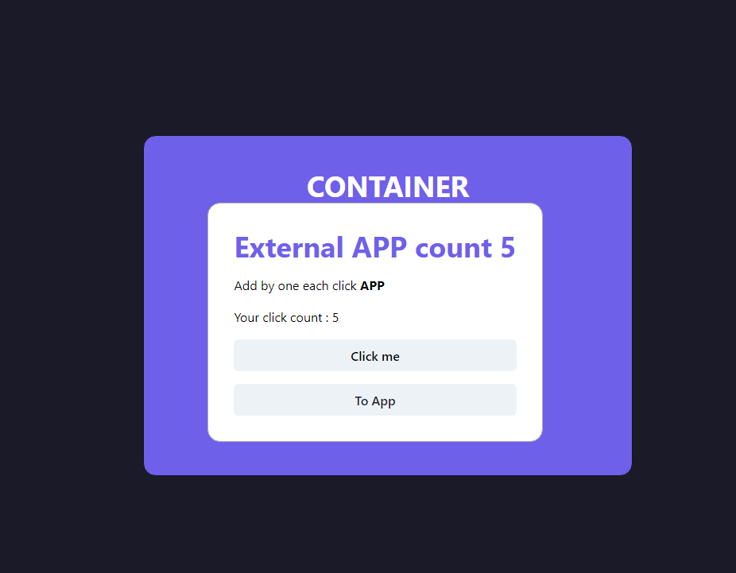

# Webpack 5 Module Federation with React/Typescript + communication between components

This project consist of two pieces, a host app `container` and two remotes `app1`. Besides that the components have an example of communication between them.

Workflow:

- `app1` expose CounterAppOne component.
- `container` import CounterAppOne component.

## Running Demo

In order to run the demo I highly recommend installing lerna globally via

```bash
npm i -g lerna
```

Then,

```bash
lerna bootstrap
```

Run the command above at the root of your project. This command will make sure you have dependencies you need in order to run this project.

Finally,

```bash
npm run start
```

Lerna will start all your projects parallelly and open your browser.

- http://localhost:3000/ (container)
- http://localhost:3001/ (app1)

## Screenshots



## Tech Stack

React, Typescript, Chakra UI, Webpack, Lerna, React Router V6

### Article

If you are curious about building this template head over to [Introduction to Micro Frontends with Module Federation, React and Typescript](https://ogzhanolguncu.com/blog/micro-frontends-with-module-federation)
